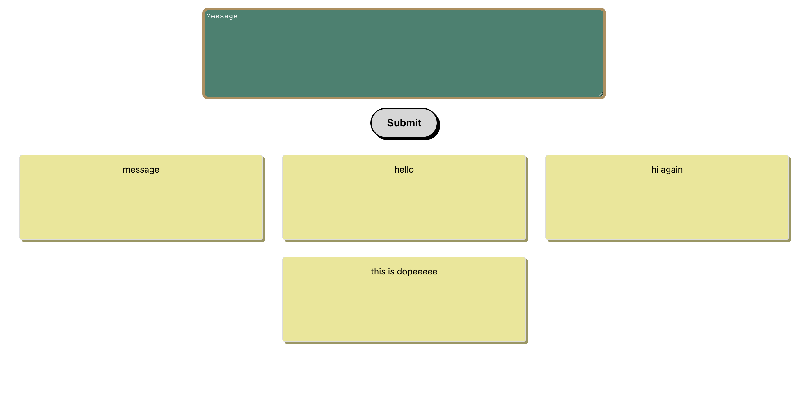

# Drop-Note

A fun application to write and display messages. Project is build using MERN.

## Project Status

- Complete just needs to be deployed.

## Reflection

1. What was the context for this project?\
   This project was made to practice configuring a MERN stack build.
2. Tools used:

- MERN
- Mongodb
- React
- Express
- Nodejs
